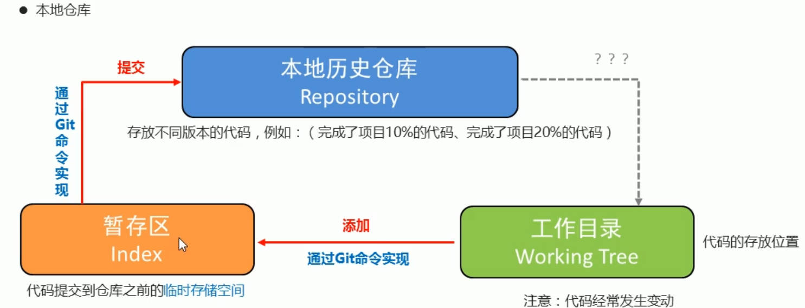
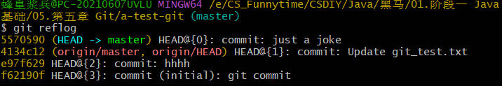

# Git

SVN和Git

- SVN，集中式版本控制系统，版本库集中放在中央服务器。下载和上传都要经过中央服务器。

- Linus Torvalds于2005年开发了开源分布式版本控制工具Git，分为本地仓库和远程仓库，每一个客户端都保存了完整的代码和历史记录。


## Git基本操作



| 命令                                | 作用                                                         |
| ----------------------------------- | ------------------------------------------------------------ |
| git init                            | 初始化，创建 git 仓库                                        |
| git status                          | 查看 git 状态 （文件是否进行了添加、提交操作）               |
| git add 文件名/git add .            | 添加，将指定文件添加到暂存区                                 |
| git commit -m '提交信息'            | 提交，将暂存区文件提交到历史仓库                             |
| git log                             | 查看日志（ git 提交的历史日志）                              |
| git reflog                          | 查看所有分支的所有操作记录（包括已经被删除的commit记录的操作） |
| git reset --hard 版本索引值         | 切换到历史版本                                               |
| git branch 分支名                   | 创建分支                                                     |
| git checkout 分支名                 | 切换分支                                                     |
| git branch                          | 查看分支                                                     |
| git merge 分支名                    | 把“分支名”合并到当前分支                                     |
| git branch -d 分支名                | 删除分支                                                     |
| git push                            | 推送本地仓库内容到远程仓库                                   |
| git pull                            | 拉取，更新远程仓库中的内容到本地仓库                         |
| git clone 仓库地址                  | 将远程仓库中的内容复制到本地仓库                             |
| git config user.name                | 查看git账户                                                  |
| git config user.email               | 查看git邮箱                                                  |
| git config --global user.name       | 设置全局账户名                                               |
| git config --global user.email      | 设置全局邮箱                                                 |
| git remote add 远程名称 远程仓库URL | 将远程仓库与本地Git仓库关联，将指定的远程仓库URL与指定的名称关联起来，可以通过该名称引用远程仓库 |
| git push -u 仓库名称 分支名         | 推送到远程仓库的分支                                         |

### `git commit`退出

仅使用`git commit`而不使用`git commit -m`时会进入vim编辑器中

保存并退出：

- 按 `Esc` 键退出编辑模式，英文模式下输入 `:wq` ，然后`回车`(write and quit)。
- 按 `Esc` 键退出编辑模式，大写英文模式下输入 `ZZ` ，然后`回车`。

不保存退出：

- 按 `Esc` 键退出编辑模式，英文模式下输入 `:q!` ，然后`回车`。
- 按 `Esc` 键退出编辑模式，英文模式下输入 `:qa!` ，然后`回车`。

另外`git log`的退出只需要按英文的q即可


## 版本控制

### 历史版本切换

使用`git reflog`查看分支操作记录



使用`git reset --hard f62190f`切换到历史版本

再使用`git reset --hard 5570590`切换回来

### 分支管理

#### 创建和切换分支

创建命令：git branch 分支名

切换命令：git checkout 分支名

查看命令：git branch

#### 合并分支（冲突）

合并命令：git merge 分支名

**<<<<<<<和>>>>>>>中间的内容,就是冲突部分**

1. 修改冲突行，保存，即可解决冲突。
2. 重新add冲突文件并commit到本地仓库，重新push到远程

#### 删除分支

删除命令：git branch -d 分支名


## 使用GitHub

### 基本使用

clone项目：git clone xxx

搜索技巧

- 找百科大全 awesome xxx
- 找例子 xxx sample
- 找空项目架子 xxx starter / xxx boilerplate
- 找教程 xxx tutorial

### 配置git账户

配置Git以便它能够识别用户，从而在提交代码到版本控制仓库时可以将用户的身份信息与提交相关联。这通常包括姓名和电子邮件地址。

#### 配置流程

1. **设置用户名和邮箱地址**：在命令行中，使用以下命令来设置用户名和电子邮件地址

   ```bash
   git config --global user.name "Your Name"
   git config --global user.email "youremail@example.com"
   ```

   这将把姓名和电子邮件地址添加到全局Git配置文件中，使它们成为全局默认值。可以使用 `--global` 标志来确保这些设置对所有Git项目都有效。

2. **检查设置**：使用以下命令来检查已配置的Git账户信息

   ```bash
   git config --global --get user.name
   git config --global --get user.email
   ```

   这将显示Git用户名和电子邮件地址。

#### 查找配置文件

git的全局配置文件通常存储在用户主目录下的`.gitconfig`文件中，通常可以使用以下命令打开

```bash
echo ~/.gitconfig
```

#### 更改git账户信息

请勿随意更改git账户信息，如果要更改，则使用以下命令

```bash
git config --global user.name "New Name"
git config --global user.email "newemail@example.com"
```

### 配置SSH公钥

SSH 公钥（SSH public key）是一种安全性和身份验证机制，常用于连接到远程服务器和版本控制托管平台如 GitHub 和 Gitee。它用于验证您是合法的用户，并且具有访问特定资源的权限，而不需要在每次操作时输入密码。

#### 配置流程

1. **生成SSH密钥对**：生成一对SSH密钥，其中包括一个公钥和一个私钥。私钥是私有的，应该仅存储在本地计算机上，而公钥可以分享给其他人或服务。

   ```bash
   ssh-keygen -t rsa -b 4096 -C "3360522303@qq.com"
   ```

   在上述命令中，`-t` 指定密钥类型（通常使用 RSA），`-b` 指定密钥长度，`-C` 用于添加注释，通常将您的电子邮件地址作为注释。

2. **获取SSH公钥**：生成SSH密钥对后，您可以使用以下命令来获取您的SSH公钥：

   ```bash
   cat ~/.ssh/id_rsa.pub
   ```

   输出SSH公钥的内容，将其复制并用于配置在GitHub、Gitee或其他支持SSH认证的服务。

3. **将SSH公钥配置到远程服务**：在GitHub、Gitee或其他托管平台上，添加SSH公钥，以便它们可以识别您的计算机。

4. **使用SSH进行身份验证**：公钥配置后，使用SSH连接到远程服务器或托管平台，不需要再输入密码。这有助于更安全地进行身份验证，特别是在使用Git等工具时。

#### 查找或重新生成SSH密钥

1. **默认SSH密钥位置**：SSH密钥对通常存储在用户主目录下的`.ssh`文件夹中。可以使用以下命令来查看是否有SSH密钥对存在：

   ```bash
   ls ~/.ssh
   echo ~/.ssh/id_rsa
   ```

   这将列出`.ssh`文件夹中的所有文件，包括SSH密钥文件。通常SSH私钥的文件名是`id_rsa`，而公钥的文件名是`id_rsa.pub`。

2. **重新生成**：如果找不到SSH密钥对，或者出于安全原因您希望重新生成它们，您可以使用以下命令来生成新的SSH密钥对：

   ```bash
   ssh-keygen -t rsa -b 4096 -C "3360522303@qq.com"
   ```

   这将生成一个新的SSH密钥对，并提示您选择要保存的文件名和位置。通常情况下，这将生成新的`id_rsa`和`id_rsa.pub`文件。

### GitHub Desktop


## IDEA集成Git 

### IDEA中配置Git(应用)

1. File -> Settings


2. Version Control -> Git -> 指定git.exe存放目录


3. 点击Test测试


### 创建本地仓库(应用)

1. VCS->Import into Version Control->Create Git Repository

   

2. 选择工程所在的目录,这样就创建好本地仓库了

   

3. 点击git后边的对勾,将当前项目代码提交到本地仓库

   注意: 项目中的配置文件不需要提交到本地仓库中,提交时,忽略掉即可

   

### 版本切换(应用)

+ 方式一: 控制台Version Control->Log->Reset Current Branch...->Reset

  这种切换的特点是会抛弃原来的提交记录

  

+ 方式二:控制台Version Control->Log->Revert Commit->Merge->处理代码->commit

  这种切换的特点是会当成一个新的提交记录,之前的提交记录也都保留

  

  

  ​		


### 分支管理(应用)

+ 创建分支

  VCS->Git->Branches->New Branch->给分支起名字->ok

  

+ 切换分支

  idea右下角Git->选择要切换的分支->checkout

  

+ 合并分支

  VCS->Git->Merge changes->选择要合并的分支->merge

  

  处理分支中的代码

  

  

  

+ 删除分支

  idea右下角->选中要删除的分支->Delete

  

### 本地仓库推送到远程仓库(应用)

1. VCS->Git->Push->点击master Define remote

   

2. 将远程仓库的路径复制过来->Push

   

### 远程仓库克隆到本地仓库(应用)

File->Close Project->Checkout from Version Control->Git->指定远程仓库的路径->指定本地存放的路径->clone


