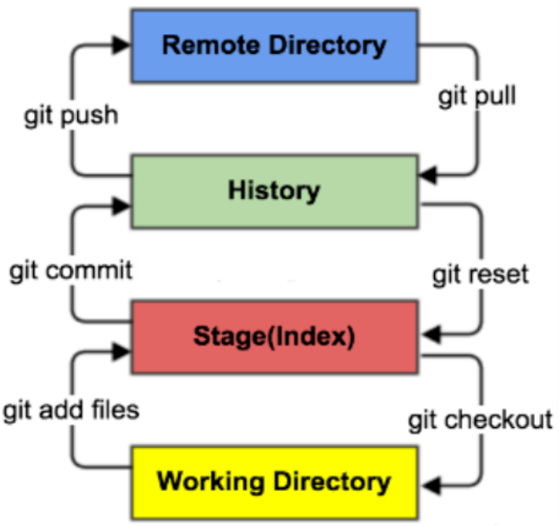
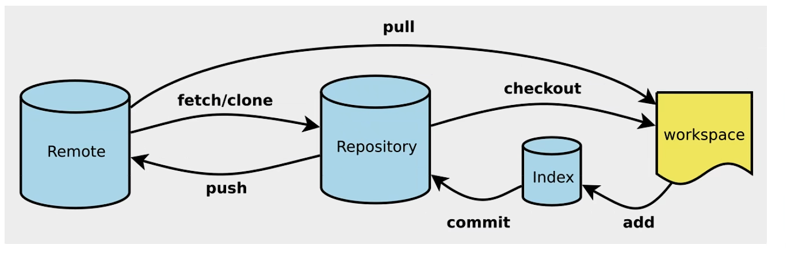
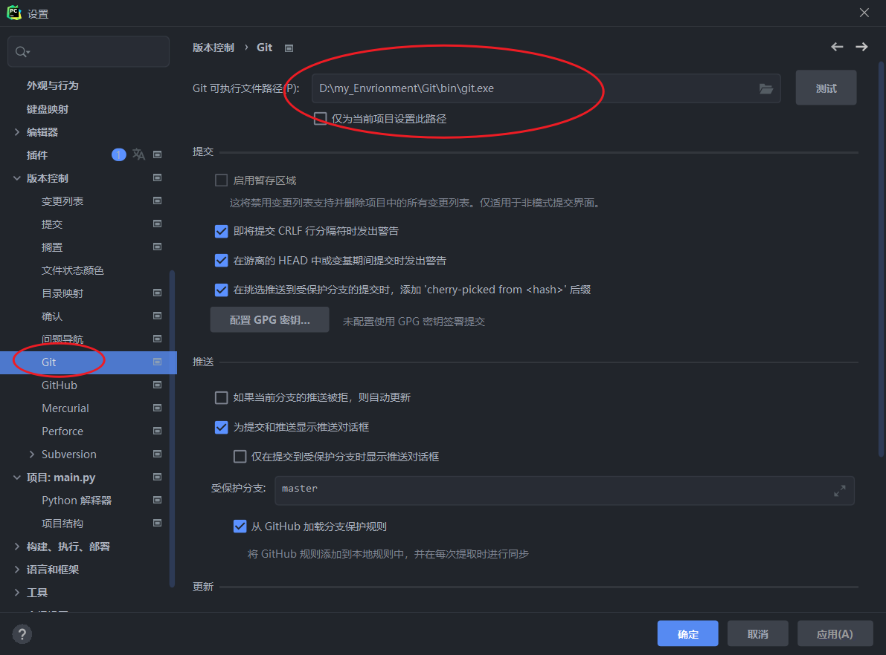
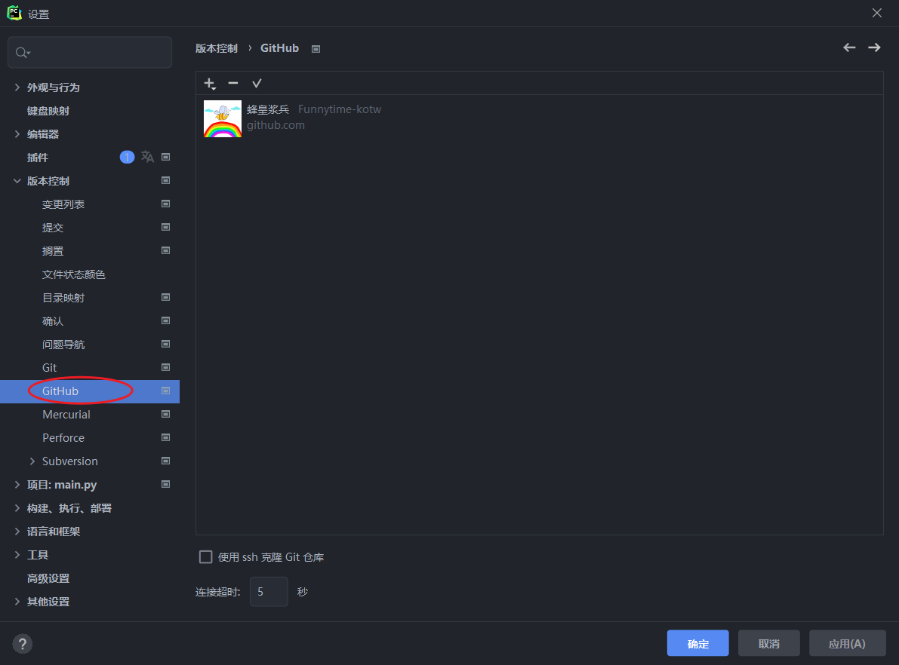
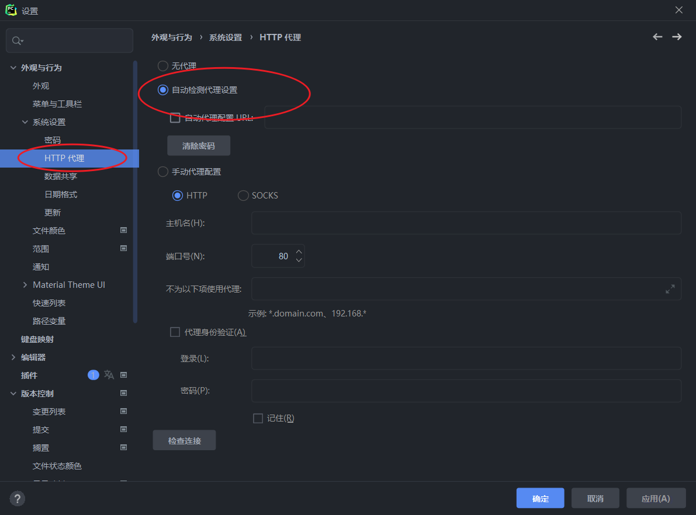
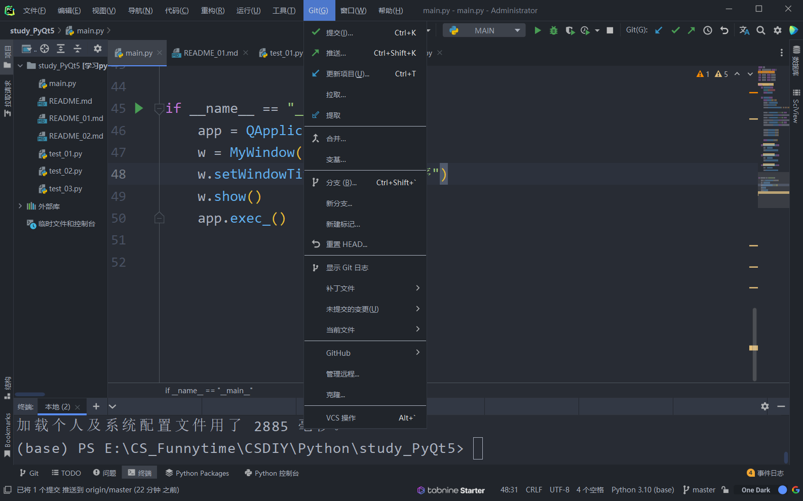

# Git

## Git环境配置

### Git和SVN主要区别

SVN是集中式版本控制系统，版本库集中在中央服务器，工作时需要先从中央服务区获取最新版本再进行工作。结束后需要将自己完成的内容推送到中央服务器。集中式版本控制必须联网才能工作，对网络带宽要求较高。

Git是分布式版本控制系统，没有中央服务器，每个人的电脑都是一个完整的版本库，版本都存储在自己的电脑上，工作时不必联网。需要协同时（例如自己电脑上修改了文件A，其他人也修改了文件A），只需要把各自修改的文件推送给对方，就可以互相看到对方的修改。

- Git Bash：Unix和Linux风格的命令行，推荐使用
- Git CMD：Windows风格的命令行
- Git GUI：图形界面的GIt，不推荐使用

### 常用的Linux命令

```bash
1. cd  改变目录
2. cd ..  回退到上一个目录
3. pwd  显示当前所在目录路径
4. ls  列出当前目录中的所有文件，ll列出的内容更加详细
5. touch  新建一个文件
6. rm  删除一个文件
7. mkdir  新建一个文件夹
8. rm -r  删除一个文件夹    ！！！一定不要尝试使用rm -rf /，会递归删除所有文件
9. mv  移动文件
10. reset  重新初始化
11. clear  清屏
12. history  查看历史命令
13. help  帮助
14. exit  退出
```

### Git配置

- 查看配置  `git config -l`
- 查看系统config  `git config --system --list`
- 查看当前用户（global）配置  `git config --global  --list`

==相关配置文件所在路径==

- Git\etc\gitconfig  ：Git 安装目录下的 gitconfig   --system 系统级
- C:\Users\Administrator\ .gitconfig   只适用于当前登录用户的配置  --global 全局

==设置用户名与邮箱（用户标识，必要）==

- git config --global user.name "funnytime-kotw"
- git config --global user.email 3360522303@qq.com


## Git基本理论（核心）

Git本地有三个工作区域：工作目录（Working Directory）、暂存区(Stage/Index)、资源库(Repository或Git Directory)。如果在加上远程的git仓库(Remote Directory)就可以分为四个工作区域。文件在这四个区域之间的转换关系如下：



- Workspace：工作区，平时存放项目代码的地方
- Index / Stage：暂存区（或比对区），用于临时存放你的改动，事实上它只是一个文件，保存即将提交到文件列表信息
- Repository：仓库区（或本地仓库），就是安全存放数据的位置，这里面有你提交到所有版本的数据。其中HEAD指向最新放入仓库的版本
- Remote：远程仓库，托管代码的服务器，可以简单的认为是你项目组中的一台电脑用于远程数据交换

### ==工作流程==

1. 在工作目录中添加、修改文件
2. 将需要进行版本管理的文件放入暂存区域   git add .
3. 将暂存区域的文件提交到git仓库  git commit

因此，git管理的文件有三种状态：已修改（modified）,已暂存（staged）,已提交(committed)


## Git项目搭建



### 本地仓库搭建：

- 如果要创建一个全新的仓库：`git init`

- 如果要克隆一个远程仓库：`git clone [url]`

### 文件的四种状态：

- Untracked：未跟踪，此文件在文件夹中，但并没有加入到git库，不参与版本控制。通过git add .状态变为Staged
- Unmodify：文件已经入库。未修改，即版本库中的文件快照内容与文件夹中完全一致. 这种类型的文件有两种去处，如果它被修改，而变为Modified。如果使用git rm移出版本库，则成为Untracked文件
- Modified：文件已修改，仅仅是修改，并没有进行其他的操作。这个文件也有两个去处，通过git add可进入暂存staged状态，使用git checkout 则丢弃修改过，返回到unmodify状态，这个git checkout即从库中取出文件，覆盖当前修改 !
- Staged：暂存状态，执行git commit则将修改同步到库中，这时库中的文件和本地文件又变为一致，文件为Unmodify状态。执行git reset HEAD filename取消暂存, 文件状态为Modified

### ==更改文件状态==：

```bash
# 查看指定文件状态
git status [filename]

# 查看所有文件状态
git status

# 添加所有文件到暂存区
git add .        

# 提交暂存区中的内容到本地仓库 -m 提交信息，把本地未提交的文件提交到暂存区
git commit -m "消息内容"    

# 将本地仓库文件提交到远程仓库
git push

# 获取远程仓库更新
git pull
```

### ==忽略文件==

某些文件不想纳入版本控制中，比如数据库文件，临时文件等，可以在主目录下创建".gitignore"文件，此文件的规则如下：

1. 忽略文件中的空行或以井号（#）开始的行将会被忽略。
2. 可以使用Linux通配符。例如：星号（*）代表任意多个字符，问号（？）代表一个字符，方括号（[abc]）代表可选字符范围，大括号（{string1,string2,...}）代表可选的字符串等。
3. 如果名称的最前面有一个感叹号（!），表示例外规则，将不被忽略。
4. 如果名称的最前面是一个路径分隔符（/），表示要忽略的文件在此目录下，而子目录中的文件不忽略。
5. 如果名称的最后面是一个路径分隔符（/），表示要忽略的是此目录下该名称的子目录，而非文件（默认文件或目录都忽略）。

```bash
# 为注释
*.txt        # 忽略所有 .txt后缀文件,这样的话上传就不会被选中！
!lib.txt     # 但lib.txt除外
/temp        # 仅忽略项目根目录下的temp文件,不包括其它目录temp
build/       # 忽略build/目录下的所有文件
doc/*.txt    # 会忽略 doc/notes.txt 但不包括 doc/server/arch.txt
```

### ==使用Github==

设置本机绑定==SSH(Secure Shell Protocol)==公钥，实现免密码登录

```bash
# 进入 C:\Users\Administrator\.ssh 目录
# 生成公钥
ssh-keygen -t rsa
```

使用Github创建一个仓库，许可证：GPL-3.0，然后克隆到本地

```bash
git add .  # 添加到暂存区
git commit -m "send file to Github"  # 添加到本地仓库
git push  # 提交到远程仓库
```

#### ==在PyCharm使用Github==

1. 配置git

   ```bash
   git config --global user.name "用户名"
   git config --global user.email  "用户邮箱"
   ```

2. git ssh

   ```bash
   ssh-keygen -t rsa -C "你的邮箱"  三个连续回车，设置密码为空
   # 在C盘中找到.ssh，得到id_rsa和id_rsa.pub，用记事本打开id_rsa.pub，复制里面的内容。
   # 打开GitHub-Personal settings-SSH and GPG keys
   ```

   

3. 在PyCharm里配置git

   

4. 在PyCharm绑定Github并给Github设置自动代理

   

   

5. 用git更新库、克隆库

   


## Git分支管理

git分支中常用指令：

```bash
# 列出所有本地分支
git branch

# 列出所有远程分支
git branch -r

# 新建一个分支，但依然停留在当前分支
git branch [branch-name]

# 新建一个分支，并切换到该分支
git checkout -b [branch]

# 合并指定分支到当前分支
git merge [branch]

# 删除分支
git branch -d [branch-name]

# 删除远程分支
git push origin --delete [branch-name]
git branch -dr [remote/branch]

# 添加标签
git tag -a 标签名 -m "备注"
```

### ==版本号([b站尚硅谷p20](https://www.bilibili.com/video/BV1wm4y1z7Dg/?p=20))==

SHA-1：40位

定位仓库中的文件：2+38

